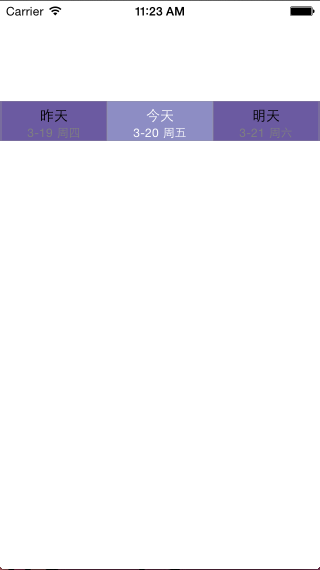

### 时间选择控件

#### 初始化

	ZQDatePicker *picker = [[ZQDatePicker alloc]
                            initWithFrame:CGRectMake(0, 100, self.view.frame.size.width, 40)];
	picker.backgroundColor = [UIColor colorWithRed:107/255.0 green:90/255.0 blue:161/255.0 alpha:1];
	[picker setSelectedColor:[UIColor colorWithRed:141/255.0 green:141/255.0 blue:196/255.0 alpha:1]];
	
设置当前默认选中的日期

	[picker setCurrentDate:[NSDate date]];
	
选中日期时的回调方法

	[picker setSelectedBlock:^(NSDate *date) {
        NSLog(@"%@", date.description);
    }];

